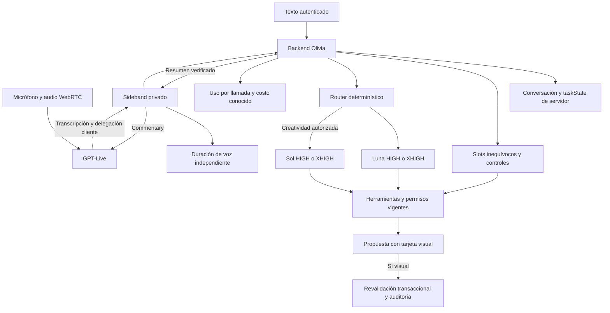

# Política de modelos y tareas conversacionales

Este anexo reemplaza la selección anterior de modelos y el protocolo de voz predeterminado de la evolución de PR31. Se implementa en PR34, sin promover producción ni escribir pruebas comerciales en el Firebase empresarial.

## Política central, versión 2

| Trabajo | Modelo predeterminado | Razonamiento |
|---|---|---|
| Operación habitual administrativa o vendedor | `gpt-6-luna` | `high` |
| Pronóstico, comparación, análisis complejo | La misma Luna | `xhigh` |
| Contenido/diseño creativo en Marketing o Redes con permiso | `gpt-6.1-sol` | `high` |
| Creatividad con análisis, restricciones o volumen complejo | La misma Sol creativa | `xhigh` |
| Conversación de voz | `gpt-live-1` | Delega al backend cliente |
| Slots inequívocos, esperar, cancelar, confirmación visual | Código de aplicación | Sin llamada de razonamiento |

La [documentación de Luna](https://developers.openai.com/api/docs/models/gpt-6-luna) y de [Sol](https://developers.openai.com/api/docs/models/gpt-6.1-sol) confirma los IDs y niveles utilizados. La disponibilidad en la cuenta configurada requiere una llamada real, que no forma parte de las pruebas con fixtures.

`modelRouter.mjs` clasifica intención y decide usando módulo autorizado, términos de análisis, fechas distantes, restricciones, Skill, adjuntos, entidades, filas y herramientas. La longitud por sí sola no escala. El módulo Marketing/Redes por sí solo tampoco elige Sol: métricas, inbox y registro operativo de campañas siguen en Luna. No existe fallback general de Luna a Sol.

La decisión no llama a otro modelo. Un aumento de complejidad entre rondas sube el razonamiento de Luna, conserva el modelo y registra cada llamada por separado. Una aclaración breve mantiene la ruta de la tarea incompleta; una intención nueva o una tarea completada permite volver a HIGH. Las Skills de pronóstico activan XHIGH; los análisis simples de ventas mantienen HIGH.

`oliviaConfiguration/global` contiene `modelPolicyVersion`, perfiles, `routing`, `responseLimits`, `voiceProtocol` y tarifas. El administrador puede editar y confirmar perfiles HIGH/XHIGH, umbrales, límites y tarifas. Los modelos administrativos normal/complejo deben pertenecer a Luna y coincidir; los perfiles creativos deben pertenecer a Sol y coincidir. La validación rechaza escalamiento administrativo a Sol. Al leer configuración de política anterior se normalizan sus perfiles en memoria; no se reescribe producción. `complexModules` se conserva solo por compatibilidad y no decide la ruta. `OLIVIA_MODEL_COMPLEX` anterior deja de seleccionar otro modelo.

## Estado persistente de tarea

La conversación conserva `taskState`: ID generado por servidor, intención, revisión, estado, slots, faltantes, ambigüedades, ruta y fechas. La lease de la conversación impide que una respuesta reemplazada pueda publicar una tarjeta tardía. El frontend nunca aporta este estado como autoridad. Los slots y documentos son candidatos: los servicios revalidan permisos, entidades y datos vivos al preparar y confirmar.

`tasks.mjs` define mínimos por intención sobre los contratos de herramientas. Venta requiere decisiones de promoción, pago, cliente y factura; carga de stock requiere producto, cantidad y destino, con motivo opcional; pronóstico requiere feria, fecha y días. Las opciones de filtro o identificadores de altas intencionalmente nulos no se solicitan como si fueran datos faltantes. `update_task` admite solamente intents habilitados y campos validados de su contrato. Puede almacenar parámetros parciales antes de preguntar, sin ejecutar una operación.

El flujo revisa mensaje, historial reciente, memoria, tarea, pantalla y herramientas. La pantalla es un candidato y las correcciones explícitas prevalecen. La pregunta traduce faltantes a español, agrupa datos relacionados y no muestra nombres técnicos ni pide IDs. El contenido creativo puede conservar objetivo, público, formato y estilo mediante un brief validado.

La carga de stock tiene una ruta determinística con búsquedas reales y acotadas. Ejemplo probado: «Cargame 12 botellas de Original» resuelve presentación o pide desambiguar; «Tribunales» resuelve destino y prepara la tarjeta con stock anterior/posterior sin pedir motivo. «Reposición» puede añadir un motivo y reemplazar la propuesta. Sin motivo se conserva la descripción estándar «Ingreso de mercadería» del plan compartido. «Mejor 20» y «Mejor Pilar» corrigen la misma tarea y revocan la tarjeta anterior. «Sí» conserva la tarjeta sin escribir stock; «Cancelá» cancela la tarea y la propuesta.

`resolve_transfer_origin` consulta stock actual de inventarios autorizados y propone un origen solo si es único y la búsqueda está completa. Si dos depósitos alcanzan, devuelve sus nombres y exige elección. Preparación/recepción física desconocida se representa con `null` y se pregunta expresamente; nunca se deriva de la cantidad prevista. Los servicios y planes de transferencia existentes siguen siendo la autoridad.

Las demás tareas usan Luna/Sol con `update_task`, herramientas de búsqueda y preparación. Los tests inyectan respuestas controladas para verificar esa integración; no certifican que un modelo real elija siempre la herramienta o formule cada pregunta del mismo modo.

## GPT-Live y texto

`createLive` usa [POST /v1/live/sessions](https://developers.openai.com/api/reference/resources/live/methods/create), audio WebRTC y `delegation.type=client`. `OliviaLive` espera ICE completo y `session.started`. La clave permanece en el servidor, que conserva la relación entre IDs. La API de Olivia devuelve al browser un ID de sesión propio; los eventos de transporte del proveedor pueden incluir su ID público.

El canal del browser admite solo mute/unmute/cierre; no admite instrucciones, resultados ni herramientas. `liveMonitor` se adjunta a la sesión por un WebSocket autenticado, reúne transcripciones y recibe `session.delegation.created`. Ese evento contiene un ID, no el texto del usuario; el backend correlaciona transcripción e historial y llama al mismo `engine.chat` utilizado por texto. La delegación se deduplica en un registro privado. Las consultas empresariales, análisis y preparaciones pasan por el backend; respuestas conversacionales simples pueden permanecer en GPT-Live. [Delegación y contexto](https://developers.openai.com/api/docs/guides/live-delegation).

El servidor persiste intervenciones simples sin invocar Luna. Una respuesta empresarial canónica conserva además su versión hablada, evitando dos burbujas para un mismo resultado. El monitor devuelve un resumen breve mediante `session.commentary.append`; no realiza otra llamada para reescribirlo. También refleja resultados escritos y confirmaciones visuales desde la conversación de servidor.

Una corrección durante trabajo aborta la solicitud delegada y revoca su lease. El resultado anterior no puede recrear una propuesta. La interrupción se solicita por endpoint autenticado, se aplica desde el sideband y controla reproducción en el cliente. Mute mantiene la sesión y permite continuar por texto. La sesión tiene tope de tres minutos. El protocolo Realtime anterior se conserva como opción administrativa explícita, sin fallback automático ni cambio silencioso de costo.

El cierre mantiene conexiones hasta `session.closed` o un timeout acotado. Ese evento confirma duración final; un corte sin él conserva la última duración observada y registra finalización incompleta. [Controles y cierre oficiales](https://developers.openai.com/api/docs/guides/voice-server-controls).

## Uso, costo y seguridad

Cada llamada Responses guarda modelo/esfuerzo/ruta/motivo, tokens y costo conocidos, duración, herramientas, módulo, Skill, conversationId y taskId. Los fallos dejan costos desconocidos cuando falta medición. El panel de desarrollo administrativo muestra ruta y tarea; la configuración agrega distribución de las llamadas de los últimos 500 registros. No cuenta comandos determinísticos como llamadas de modelo. Una ronda que pasa de HIGH a XHIGH aparece en ambas categorías según sus llamadas reales.

GPT-Live se contabiliza aparte por segundos. La tarifa central inicial es USD 0,05/minuto, tomada de [GPT-Live](https://developers.openai.com/api/docs/models/gpt-live-1). La creación WebRTC factura 15 segundos que se acreditan contra la duración: se aplica el piso de inicialización, sin sumar otros 15 segundos a una sesión ya contabilizada. [Contabilidad oficial](https://developers.openai.com/api/docs/guides/voice-latency-cost). Con finalización no confirmada el importe queda desconocido. No se inventan tokens de audio; los tokens de backend quedan en sus eventos propios. La reserva inicial de admisión se libera al cerrar; el límite temporal controla la exposición de voz. Los costos de almacenamiento/Firestore sin medición no están incluidos en esas cifras.

La transacción de confirmación sigue releyendo perfil, permisos, cuota y huella de datos. Ningún modelo confirma acciones, modifica reglas, concede permisos ni publica contenido. `oliviaLiveDelegations` y el resto del estado Olivia rechazan lecturas/escrituras directas de browser. La limpieza programada incluye nuevas delegaciones; la retención reconoce solicitudes Live. Los fallos preservan slots conocidos, muestran error y permiten continuar con una nueva solicitud o el flujo manual; no cambian a Sol.

## Diagrama

Pruebas y evidencia: `olivia-router-tasks.test.mjs`, `olivia-live.test.mjs`, suites existentes y reglas de emulador. La [matriz del anexo](OLIVIA-ANNEX-REQUIREMENTS.md) distingue código implementado, evidencia con fixtures y validaciones externas pendientes.
