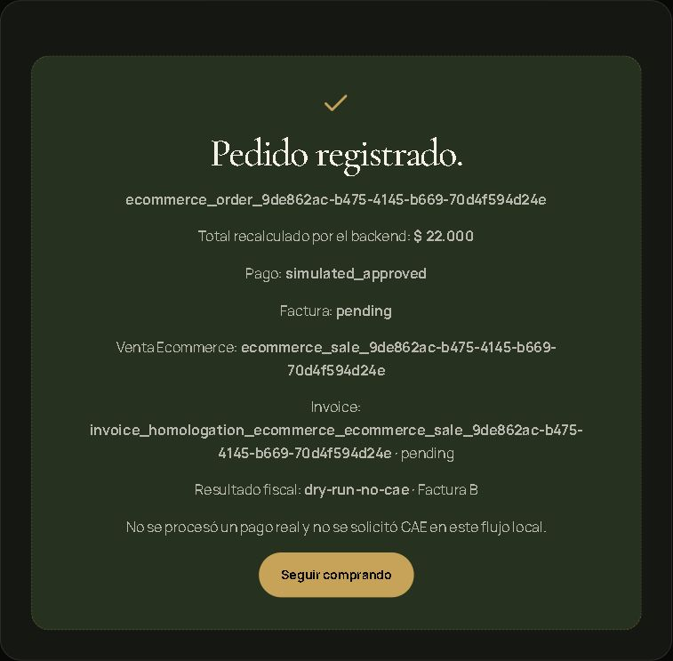

# Etapa 6 — Checkpoint NIVEL A, 2026-10-02

Cierre del flujo local de pago simulado y preparación fiscal sin CAE. Se corrigió el código, se ejecutaron servicios contra Firebase Emulator y Netlify Dev, y se revisó la UI en desktop y móvil. Este resultado corresponde exclusivamente a NIVEL A. NIVEL B no se inició.

**CAE PRODUCTIVOS DEL CHECKPOINT: 0 · DEPLOYS: 0 · DEPLOY PREVIEWS: 0 · PUSHES: 0.**

## Entorno, rama, SHAs y Git status

| Dato | Evidencia |
|---|---|
| Inicio | 2026-10-02 00:22:00, America/Buenos_Aires |
| Consolidación del informe | 2026-10-02, misma sesión local |
| Sistema | Windows, PowerShell |
| cwd del checkpoint | `C:\Users\agsba\OneDrive\Documentos\ChatGPT\FM-Ecommerce-Etapa6-Audit` |
| Repo | `https://github.com/AgustinBazanUB/App-Integral-FM.git` |
| Rama local | `codex/ecommerce-stage6-level-a` |
| Etapa 5 | `7ceba3915adb019644aede7bafa944290087797e` |
| Etapa 6 / HEAD inicial | `efb6dbcfc077a674a39a584aa54b1a6986eeef28` |
| Código corregido y verificado | `64e8bfed659c92d5e49f5c9636f6a751154e0b49` |
| Recuperación de Etapa 6 | `git fetch --no-tags origin efb6dbcfc077a674a39a584aa54b1a6986eeef28`; recuperación por SHA, sin asumir una rama remota |
| Status inicial del worktree | Limpio |
| Status del código corregido | Limpio tras el commit local de correcciones; el informe se agrega en un commit posterior |
| Workspace original | Rama `feature/meta-ads-campaign-planner`, HEAD `e8734ce748249b3830926e0ef8338fb9cb5ef644`; se conservó su `?? tmp/` preexistente |
| Node / npm de tests | Node 22.17.1 / npm 10.9.2 |
| Runtime de Netlify Dev | Node 20.20.2 |
| Firebase / Netlify CLI | 14.12.0 / 27.10.0 |
| Emulator | Firestore `127.0.0.1:8186`, Auth `127.0.0.1:9186`; proyectos `demo-*` |
| Servidores locales | Netlify Dev `8886`; Vite iniciado por Netlify Dev `5186` |

[Registro inicial del entorno](evidence/environment.log). El código de otras ramas de Etapa 5 no se mezcló con esta base. El checkout original del usuario no fue cambiado de rama ni modificado.

Durante la prueba se habilitó `ECOMMERCE_SIMULATED_PAYMENT_ENABLED=true` únicamente en configuración local ignorada. No existe un flag `VITE_` que habilite la simulación del backend. Los tests unitarios usan objetos de entorno aislados; no cambian configuración productiva. El default del producto sigue siendo `false`.

Al finalizar se cerraron los cuatro procesos de QA y los puertos 8886, 5186, 8186 y 9186 quedaron sin listeners. Se restauró el flag de `.env.local` a `false` y se retiró su habilitación del guard ignorado. [Evidencia de cierre](evidence/shutdown.json).

La ubicación `qa-local`, el retiro habilitado y los datos comerciales del catálogo fueron fixtures ficticios del Emulator. No se definieron establecimiento, retiro ni entrega reales. Los gates de CAE productivo y homologación estuvieron desactivados. La allowlist efectiva del checkpoint fue exclusivamente `admin_quick_sale`.

El transporte del backend fue interceptado por un fixture local: Firestore y Auth se dirigieron a Emulators, OAuth administrativo usó una clave RSA sintética en memoria y las demás conexiones externas se bloquearon. La lectura del perfil conservó el token del usuario de Firebase Auth. No se cargaron certificados ni claves reales de ARCA.

## Comandos ejecutados y tests cuantificados

Los 61 tests ecommerce están incluidos en los 380 generales: no se suman como si fueran casos independientes.

| Comando / ejecución | Exit code | Tests | Pass | Fail | Skipped | Resultado |
|---|---:|---:|---:|---:|---:|---|
| `npm ci` en Etapa 6 | 0 | 0 | 0 | 0 | 0 | Instalación reproducible, 163 paquetes |
| `npm run test:ecommerce`, Etapa 6 original | 0 | 27 | 27 | 0 | 0 | Cobertura original; varios casos sólo leen código |
| `npm test`, Etapa 6 original | 1 | 330 | 328 | 2 | 0 | Catálogo editorial heredado falla al importar |
| `npm run build`, Etapa 6 original | 1 | 0 | 0 | 0 | 0 | JSX inválido nuevo en CheckoutPage |
| Nuevos probes runtime sobre código original | 1 | 24 | 19 | 5 | 0 | Reprodujeron fallos; luego corregidos |
| `npm test`, snapshot exacto Etapa 5 | 1 | 319 | 317 | 2 | 0 | Mismos fallos heredados del catálogo |
| `npm run build`, snapshot exacto Etapa 5 | 0 | 0 | 0 | 0 | 0 | Confirma que el fallo JSX se agregó en Etapa 6 |
| Primer arranque Firebase CLI | 1 | 0 | 0 | 0 | 0 | Ruta de rules fuera del directorio de configuración; fixture corregido |
| `npm run test:rules`, Emulator todavía no disponible | 1 | 55 | 0 | 55 | 0 | Fallo de entorno, no de reglas |
| `npm run test:rules`, Emulator fresco | 0 | 55 | 55 | 0 | 0 | Suite original |
| `npm run test:rules`, repetición antes de aislar fixtures | 1 | 85 | 60 | 25 | 0 | Datos residuales de suites heredadas |
| `npm run test:rules`, aislamiento corregido | 0 | 85 | 85 | 0 | 0 | Incluye 30 casos nuevos de autoridad ecommerce |
| Dos intentos iniciales del harness HTTP | 1 cada uno | 6 cada uno | 1 cada uno | 5 cada uno | 0 | El guard local perdía body/method de objetos Request; se corrigió el fixture |
| Harness HTTP ya corregido | 0 | 6 | 6 | 0 | 0 | Auth, capability, concurrencia y retry |
| **Harness HTTP final** | **0** | **8** | **8** | **0** | **0** | Incluye bloqueo del alias fiscal y error fiscal posterior a Sale |
| **`npm run test:ecommerce` final** | **0** | **61** | **61** | **0** | **0** | 34 nuevos tests de ejecución |
| **`npm test` final** | **0** | **380** | **380** | **0** | **0** | Incluye ecommerce, ARCA y seller-panel |
| **`npm run build` final** | **0** | 0 | 0 | 0 | 0 | Build unificado |
| **`npm run build:ecommerce` final** | **0** | 0 | 0 | 0 | 0 | Build ecommerce |
| **`git diff --check`** | **0** | 0 | 0 | 0 | 0 | Sin errores de whitespace |
| `git diff --cached --check`, primer agregado del informe | 2 | 0 | 0 | 0 | 0 | Dos espacios finales Markdown; retirados |
| `git diff --cached --check`, agregado de logs | 2 | 0 | 0 | 0 | 0 | Espacios finales del output del CLI; normalizados en las copias |
| **`git diff --cached --check`, informe corregido** | **0** | 0 | 0 | 0 | 0 | Evidencia versionada sin errores de whitespace |
| **Secret scan focalizado** | **0** | 0 | 0 | 0 | 0 | Cinco patrones, cero secretos literales detectados |
| **Inspección de persistencia en Emulator** | **0** | 0 | 0 | 0 | 0 | Seis operaciones inspeccionadas; CAE y numeración vacíos |

Los servidores son procesos largos, no suites de tests. Firebase Emulator y Netlify Dev se iniciaron correctamente y se detienen voluntariamente después del checkpoint. El primer intento de Netlify con `--framework custom` salió con código 1 porque el valor correcto del CLI es `#custom`. La UI se revisó en el puerto Vite del mismo Netlify Dev: el redirect SPA de Netlify servía HTML sin preamble de React en su puerto frontal. Estos ajustes fueron exclusivamente del runner local.

Netlify Dev se ejecutó con el CLI 27.10.0 ya disponible en cache npm y Node 20, equivalente al ejecutable de `npx netlify dev`, con `dev --offline --no-open --port 8886 --target-port 5186 --framework '#custom'` y un comando Vite local. No se ejecutó ningún comando `deploy` ni se creó un preview.

Los logs verificables están en [evidence](evidence/): [tests generales](evidence/tests-verified.log), [ecommerce](evidence/ecommerce-verified.log), [reglas](evidence/rules-isolated.log), [HTTP](evidence/http-verified.log), [build](evidence/build-verified.log), [build ecommerce](evidence/build-ecommerce-verified.log), [Netlify Dev](evidence/netlify-dev-final.log) y [secret scan](evidence/secret-scan.json).

Las copias versionadas de logs sólo normalizan espacios al final de cada línea y líneas vacías al final del archivo. Se conservaron contenido, timestamps y resultados; los originales locales permanecen en `.netlify/stage6-qa` ignorado.

## Checklist funcional obligatorio

`R` = [tests runtime versionados](../../../tests/ecommerce-stage6-runtime.test.mjs); `H` = [pruebas HTTP](evidence/http-verified.log); `P` = [persistencia real en Emulator](evidence/persistence-proof.json). Los contextos production/preview se inyectaron en tests, sin realizar deployments.

| # | Caso | Evidencia y resultado |
|---:|---|---|
| 1 | Flag off / default off | R: error específico y ninguna Sale; un flag VITE tampoco habilita backend |
| 2 | Flag on local | R, H: admin completa la operación |
| 3 | Flag on + production | R: 403 local-only, incluso con NETLIFY_DEV=true |
| 4 | Flag on + deploy-preview | R: bloqueado; branch-deploy también |
| 5 | Admin | H: Firebase Auth + perfil admin validado; 200 |
| 6 | No admin | H: seller 403; UI móvil sin panel de simulación |
| 7 | Browser manda simulate_approved al checkout público | H: 403; R cubre también replay de Order existente |
| 8 | Payment pending | R, H: Order/Payment pendientes, sin Sale ni descuento |
| 9 | Payway/rejected mediante contract | R: no Sale, Invoice ni stock descontado; no es un pago Payway real |
| 10 | simulation/approved → simulated_approved | R, H, P: provider y status conservados por separado |
| 11 | Order correcta | R, H, P: IDs y total autoritativos; vínculo al Payment y Sale |
| 12 | Sale correcta | R, P: sourceType ecommerce, ítems confirmados, pago simulation |
| 13 | Stock correcto | R, H, P: un descuento y un movimiento por producto |
| 14 | Invoice Ecommerce | H, P: una Invoice determinística, pending, CAE=null, voucherNumber=null |
| 15 | Consumidor Final | H, P: condición 5, documento 99/0, anónimo; plan B |
| 16 | CUIT | R: CUIT validado, padrón mock, receptor RI, plan A; sin transporte real |
| 17 | Total manipulado | H: clientTotal=1, total backend=44000 |
| 18 | Producto inexistente | R: rechazado antes de Sale |
| 19 | Producto inactivo | R: rechazado antes de Sale |
| 20 | Precio inválido | R: cero, boolean y array no habilitan aprobación |
| 21 | Precio cambia entre Order/aprobación | R: commercial-drift; no Sale |
| 22 | Stock insuficiente | R: rechazado; dos Orders tampoco sobrevenden |
| 23 | Payment amount inconsistente | R: amount-conflict; no Sale |
| 24 | Key incorrecta | R: conflict; las keys malformadas no se normalizan a otra identidad |
| 25 | Doble click | Desktop real: loading y controles deshabilitados; una operación persistida |
| 26 | Refresh/retry | H: idempotente; UI móvil recarga tras error y conserva el mismo pedido |
| 27 | Dos requests simultáneos | H: ambas exitosas, misma Sale/Invoice y un descuento |
| 28 | Order duplicada | R: mismo contenido devuelve misma Order; distinto contenido concurrente conflict |
| 29 | Sale duplicada | R, H, P: una por Order |
| 30 | Invoice duplicada | R, H, P: una por Sale |
| 31 | Error fiscal después de Sale | H: 400 fase invoice con simulated_approved; Sale conservada |
| 32 | Retry tras error fiscal | H y UI desktop/mobile: recupera Invoice sin recrear Sale ni descuento |
| 33 | Mock authorize sólo test | R: fuera de NODE_ENV=test devuelve 403 antes de escribir Invoice; callback no ejecutado |
| 34 | Sin CAE ficticio | P: todas las nuevas Invoices tienen CAE=null; mock nuevo sólo devuelve {test:true}, sin CAE |
| 35 | Sin FECAESolicitar | Test de imports/código y guard de red: cero transporte ARCA desde este flujo |

## Firestore Emulator

Las reglas de producto no se relajaron. Las 30 pruebas nuevas verifican **admin y seller desde SDK de navegador**:

- No crean Order, Payment, Sale Ecommerce ni Invoice.
- No actualizan Order, paymentStatus, Payment ni datos comerciales de Sale Ecommerce.
- No cambian campos fiscales, CAE, invoice status, voucher number ni invoice link.
- No actualizan Invoice ni su autorización.

La validación HTTP usa el servidor real, Firebase Auth Emulator, lectura del perfil bajo reglas y el servicio REST administrativo apuntado al Emulator. Las aprobaciones comerciales usan una transacción real de Firestore, con lecturas de Order, Payment, ubicación, productos y stock antes del commit. No se sustituyó el backend por un response mock para dar por pasado ese flujo.

## Idempotencia, Order, Payment, Sale e Invoice

[Resultados HTTP completos](evidence/http-results.json) y [seis operaciones persistidas](evidence/persistence-proof.json).

Una prueba HTTP partió de stock 20, aprobó dos requests simultáneos de dos unidades y terminó en 18. Ambas respuestas devolvieron la misma Sale y la misma Invoice. Un retry posterior fue idempotente y no modificó stock.

La prueba de error fiscal creó primero la Sale, rechazó el CUIT inválido y devolvió fase `invoice`. El retry con Consumidor Final fue exitoso: un único descuento de una unidad y una única Invoice. En móvil se repitió con la última unidad: stock **1 → 0**, error fiscal, refresh, edición del CUIT y retry exitoso. El movimiento persistido sigue siendo uno.

El estado fiscal resultante es **pending**, no authorized. `paymentProvider=simulation` y `paymentStatus=simulated_approved` no se convierten en un approved de Payway.

## Receiver y ARCA dry run

Se ejecutó el motor real `buildAuthorizationPlan` sobre la Invoice:

- Consumidor Final: plan B, voucherType estimado 6.
- CUIT RI con padrón mock: plan A, voucherType estimado 1.
- Total 44000 con IVA 21: neto 36363.64 e IVA 7636.36 en el resultado HTTP.
- Umbral CF configurado igual al total: devuelve blocker de identificación, sin solicitar CAE.
- La Invoice conserva el IVA confirmado de la Sale, aunque cambie el master después del pago.
- Un retry no puede devolver un plan para un receptor distinto del receiverSnapshot existente.

**DRY RUN verificado.** El campo fiscalEnvironment=homologation es el ámbito del snapshot, no evidencia de una factura autorizada en homologación. La consulta CUIT se probó con mock. No hubo WSAA, padrón ni FECAESolicitar reales en estas operaciones. [Resumen de red](evidence/network-summary.json).

## Desktop y móvil

Revisión interactiva en Chrome con datos ficticios, sin compra real. Desktop 1280 px y viewport normal; móvil 375×812 y resultado adicional a 430×932. Se restauró el viewport después de la prueba.

Se verificaron checkout, pasos, inputs, CUIT opcional, advertencia, capability admin, ausencia del panel para seller, botón de simulación, loading, success, error fiscal, retry y los IDs de Order/Sale/Invoice. Se ejercitaron doble click desktop y doble tap móvil. El refresh después de error conservó el pedido y habilitó el retry con stock agotado.

El ID de Invoice causaba un ancho de documento de 568 px en viewport de 375. Tras corregir el wrapping, se midieron 360 px de scrollWidth en 375 y 415 en 430, sin desborde horizontal.

Capturas: [desktop resultado](evidence/desktop-result-final.jpg), [desktop error](evidence/desktop-error.jpg), [móvil inputs](evidence/mobile-inputs.jpg), [móvil error](evidence/mobile-error.jpg), [móvil seller](evidence/mobile-seller.jpg), [móvil resultado 375](evidence/mobile-result.jpg) y [móvil resultado 430](evidence/mobile-result-430.jpg). Las capturas full-page pueden mostrar el header fijo en su posición de scroll; el DOM, los IDs y los registros del Emulator documentan el resultado.

## Fallos nuevos corregidos

| Problema de Etapa 6 | Corrección |
|---|---|
| JSX inválido del botón de simulación | Fragment correcto; ambos builds pasan |
| Payment final incompatible podía aprobarse | Validación de estado pendiente y consistencia del replay |
| CUIT inválido se convertía silenciosamente en CF | Tipo/formato/checksum validados |
| Plan fiscal podía usar otro receiver en un retry | Se compara contra el receiverSnapshot persistido |
| Error fiscal perdía contexto de retry y el stock agotado lo bloqueaba | Se conserva la Order y se reintenta la misma operación; loading protegido con ref |
| IDs largos de Invoice rompían layout móvil | overflow-wrap: anywhere |
| Preparación fiscal podía releer un IVA distinto del confirmado | Snapshot fiscal de la Sale pagada |
| Callback mock fuera de test se rechazaba después de escribir | Gate antes de la persistencia |

También se rechazan modos de endpoint desconocidos y se acortó la referencia determinística de simulación para respetar el rango de keys admitido.

## Fallos preexistentes y comparación contra base

- **Catálogo editorial:** el literal `\\n` dejaba productImage comentado. Los mismos dos fallos se reprodujeron en el snapshot exacto `7ce...`; se corrigió el archivo, no se atribuyó a Etapa 6.
- **Replay público / ID / tipos numéricos:** el retorno temprano, el spread que permitía sobreescribir IDs y la coerción de booleans/arrays ya estaban en helpers de Etapa 5. Se cerraron porque afectan el flujo de Etapa 6; sus nuevas manifestaciones en payment/fiscal también quedan protegidas.
- **Lecturas comerciales sin transacción completa:** patrón heredado de checkout; se agregó protección del read set y CAS con precondición JSON. La prueba HTTP ejecuta el servicio real sobre Firestore Emulator.
- **Asociación fiscal y origen declarado:** `ensurePendingInvoice` podía reutilizar una Invoice antes de validar otro vínculo fiscal, y un sourceType declarado podía presentarse como admin_quick_sale. Se validan los vínculos antes de reutilizar y se bloquea el alias antes del gate productivo. El HTTP al endpoint arca-invoice devuelve 403 para ese alias ecommerce.
- **Repetición de tests de reglas:** suites heredadas no limpiaban su namespace. Fallaron 25 casos al repetirse; cada suite ahora limpia su proyecto de prueba antes de sembrar fixtures, sin tocar reglas de producto.
- **Dependencias / build:** npm ci reportó cinco vulnerabilidades high; package-lock.json no cambió respecto de Etapa 5. El warning de tamaño de chunks también existe en el build de base. No se aplicó npm audit fix --force.

Los informes históricos de Etapa 4 se mantienen como auditoría separada: este checkpoint no certifica otra vez el bloqueo comercial de ventas **no ecommerce** ya facturadas, la validación Base64 de credenciales ni los diálogos fiscales del panel vendedor. Las Sales Ecommerce sí quedaron verificadas como inmutables desde navegador.

## No verificado y pendientes heredados del prompt original

- Payway no integrado; ningún pago real fue cobrado.
- Webhook Payway pendiente.
- Firma/validación del webhook pendiente.
- Reconciliación Payway pendiente.
- Tests de webhook Payway duplicado pendientes; la concurrencia local no los sustituye.
- Ecommerce **NO** está en la allowlist productiva permanente.
- CAE real pendiente de autorización posterior explícita para una sola venta e importe. NIVEL B no fue iniciado ni autorizado.
- ECOMMERCE_LOCATION_ID y configuración comercial reales siguen sin definirse; qa-local es ficticio.
- Política real de retiro, delivery, zonas y tarifas pendiente, diferida por el usuario.
- Configuración y conectividad de producción real no se inspeccionaron ni modificaron en este NIVEL A.
- Padrón CUIT real, homologación con servicios fiscales reales y emisión productiva no se probaron; el caso CUIT fue mock.
- El modelo visual Factura.pdf y generación de un PDF fiscal autorizado no se contrastaron en este checkpoint de flujo local.
- No quedan checks obligatorios desktop/mobile de NIVEL A pendientes en los viewports indicados. Otros navegadores y dispositivos físicos no fueron probados.
- Todos los comandos obligatorios de instalación, tests, reglas, build, diff y scan pudieron completarse. Los intentos fallidos de entorno se registran arriba y no cuentan como PASS.

## Reproducir exclusivamente local

Los archivos de [qa-fixtures](qa-fixtures/) son infraestructura de prueba: **copiarlos a una carpeta ignorada**, no ejecutarlos desde docs. No contienen claves reales, tokens de usuario ni una configuración que habilite la simulación por sí sola.

1. Verificar repo, rama, HEAD y status. Usar un worktree independiente basado en el código corregido indicado arriba. No push/deploy/preview.
2. `npm ci`, `npm run test:ecommerce`, `npm test`, `npm run build` y `git diff --check`.
3. Copiar los fixtures a `.netlify/stage6-qa`, y firestore.rules a `.netlify/stage6-qa/firestore.rules`.
4. Confirmar `git check-ignore .env.local .netlify/stage6-qa/guard.mjs`. La habilitación temporal se escribe en **.env.local ignorado**: `ECOMMERCE_SIMULATED_PAYMENT_ENABLED=true`. No VITE para este flag.
5. Iniciar Firebase Emulator con el config copiado, proyecto demo-ecommerce-stage6 y puertos 8186/9186. Ejecutar `npm run test:rules` con FIRESTORE_EMULATOR_HOST=127.0.0.1:8186.
6. Ejecutar seed.mjs para usuarios admin/seller ficticios y stock. Los tokens resultantes se guardan en auth-fixtures.json **dentro de .netlify**, nunca se agregan a Git.
7. Para Netlify Dev, usar NODE_OPTIONS apuntando mediante `--import=file:///.../.netlify/stage6-qa/guard.mjs`, Node 20, CLI 27.10.0 y el comando local Vite del fixture. El guard bloquea red externa y fuerza gates fiscales seguros. No usarlo en producción.
8. La UI se abre en `http://localhost:5186/.netlify/stage6-qa/login.html`; el plugin Vite de QA conecta Firebase Auth Emulator antes de restaurar la sesión. Login ficticio y luego checkout.
9. Para el harness HTTP, usar una nueva QA_HTTP_KEY en cada corrida, por ejemplo qa_http_ seguido de un UUID sin guiones; ejecutar `node --test .netlify/stage6-qa/http.test.mjs`. El sufijo de la prueba de error fiscal requiere dejar espacio dentro del máximo de 96 caracteres.
10. Ejecutar persistence-proof.mjs. Guardar evidencia, cerrar los servidores y devolver el flag local a false. No ejecutar NIVEL B automáticamente.

**CAE PRODUCTIVOS DEL CHECKPOINT = 0**

**DEPLOYS = 0**

**PREVIEWS = 0**

APROBADO
